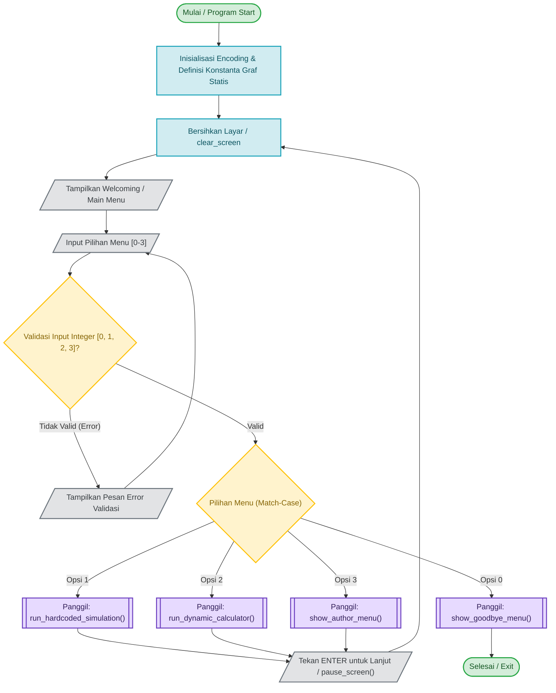
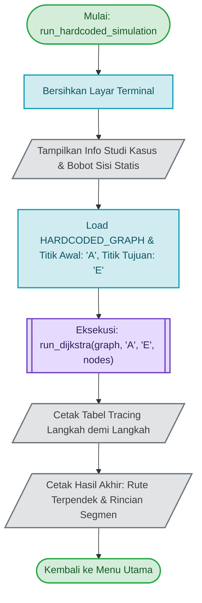
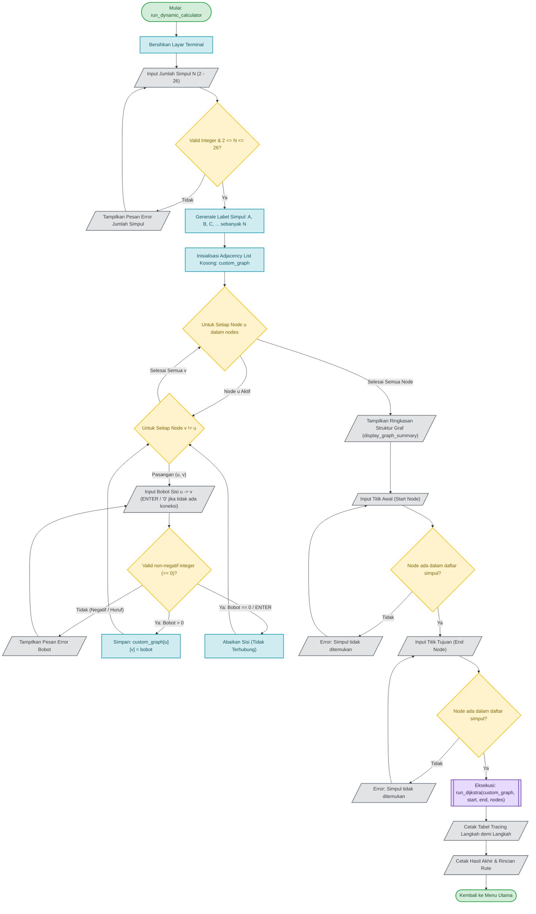
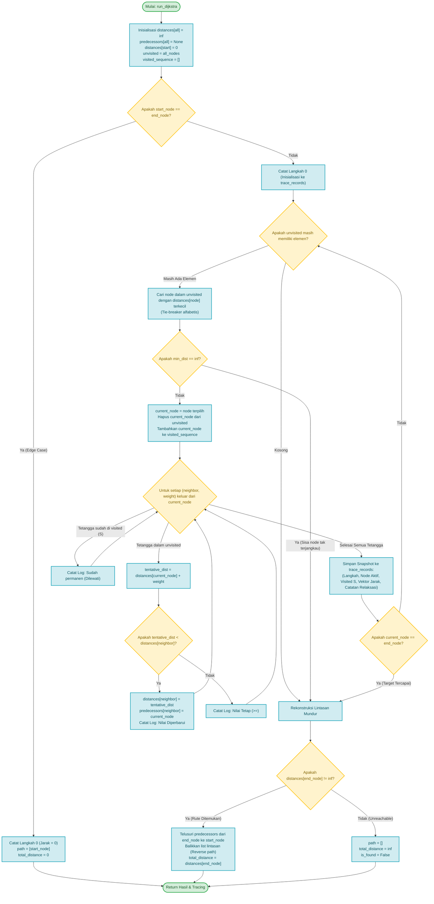
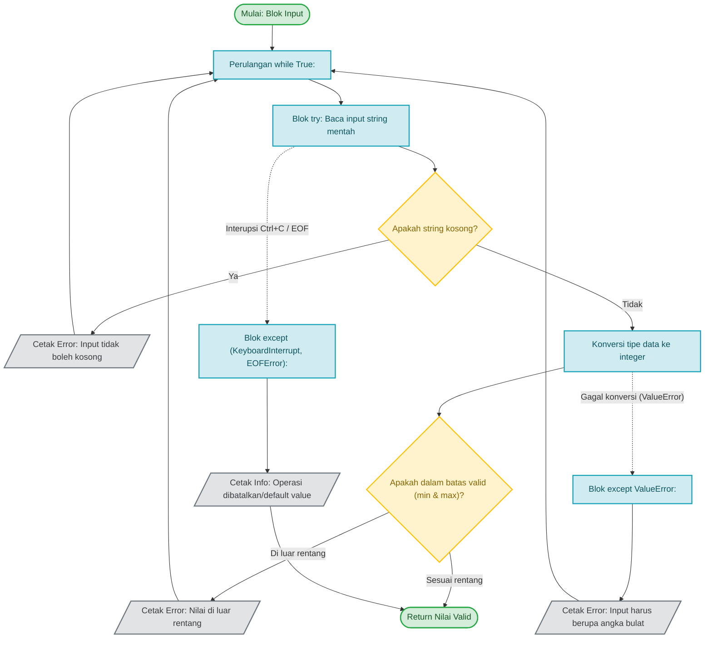

# DOKUMEN ROUGH FLOWCHART PROGRAM OPTIMASI RUTE (ALGORITMA DIJKSTRA)
**File Sumber:** `Route_Finder.py`  
**Mata Kuliah:** Kecerdasan Tiruan (I)  
**Dosen Pengampu:** I Nyoman Prayana Trisna, S.Kom., M.Cs.  
**Kelompok 6:**
- Nyoman Gede Adi Mahardika (2405551062)
- Ida Bagus Dalem Werda Adnyana (2505551131)
- Tyo Putra Kharinata (2405551162)
- Cornel Asmara Noya Oleona (2505551164)

---

## 1. Flowchart Utama Program (`main()`)

Flowchart ini menggambarkan siklus hidup aplikasi utama dari mulai inisialisasi, pembersihan terminal, tampilan menu interaktif, seleksi opsi (*match-case*), hingga terminasi program.

---

## 2. Flowchart Sub-Proses: Use Case 1 (Simulasi Graf Statis)

Menggambarkan eksekusi otomatis pencarian rute terpendek dari simpul **A** ke simpul **E** menggunakan graf *predefined* 6 simpul: `A, B, C, D, E, F`.

---

## 3. Flowchart Sub-Proses: Use Case 2 (Kalkulator Rute Dinamis)

Menggambarkan alur interaktif saat pengguna menginput jumlah simpul, matriks bobot sisi keluar per simpul, penentuan simpul awal dan akhir, hingga kalkulasi Dijkstra.

---

## 4. Flowchart Detail: Algoritma Dijkstra & Tracing (`run_dijkstra`)

Flowchart ini memodelkan logika komputasi inti Dijkstra, pengelolaan himpunan *unvisited/visited*, relaksasi tetangga, pencatatan jejak langkah (*tracing table*), hingga rekonstruksi rute mundur melalui *predecessor*.

---

## 5. Flowchart Validasi Input Foolproof (`try-except` Pattern)

Menggambarkan arsitektur pertahanan program agar kebal terhadap kesalahan ketik (*anti-crash*).

---

## 6. Tabel Referensi Simbol Standar (Draw.io Notation)

| Simbol Bentuk (Draw.io) | Notasi Mermaid | Nama Standar | Fungsi dalam Program |
| :--- | :--- | :--- | :--- |
| **Oval / Pill** | `([Text])` | *Terminator* | Menandai titik awal (*Start*) dan akhir (*End/Return*) suatu alur fungsi. |
| **Persegi Panjang** | `[Text]` | *Process* | Operasi inisialisasi, komputasi variabel, relaksasi jarak, atau pembaruan status. |
| **Belah Ketupat** | `{"Text?"}` | *Decision* | Percabangan logika kondisi (`if-else`, `match-case`, batas nilai, dan pengecekan elemen). |
| **Jajaran Genjang** | `[/"Text"/]` | *Input / Output* | Interaksi pengguna terminal: pembacaan input keyboard dan pencetakan tabel/string. |
| **Persegi Berlapis** | `[["Text"]]` | *Subroutine / Predefined Process* | Pemanggilan fungsi modular eksternal (misal pemanggilan algoritma Dijkstra). |

---
*Dokumen ini disusun untuk mempermudah pemetaan visual ke dalam aplikasi diagram seperti Draw.io, Lucidchart, atau Microsoft Visio.*

